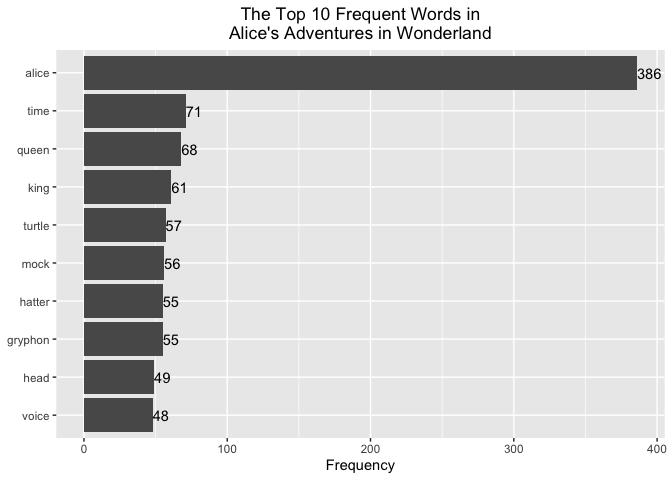
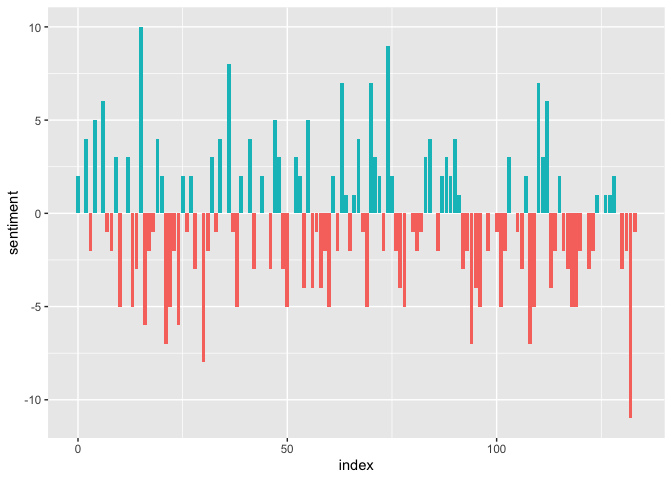
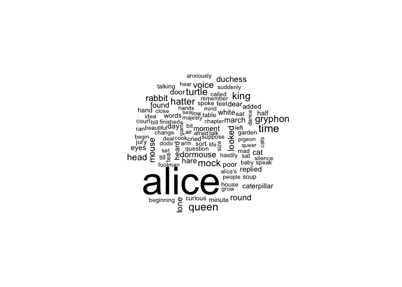
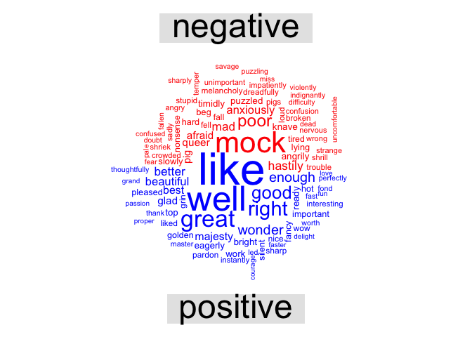
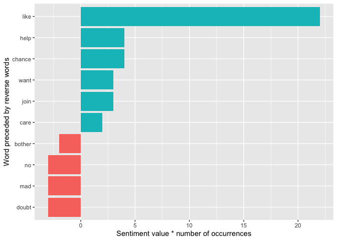
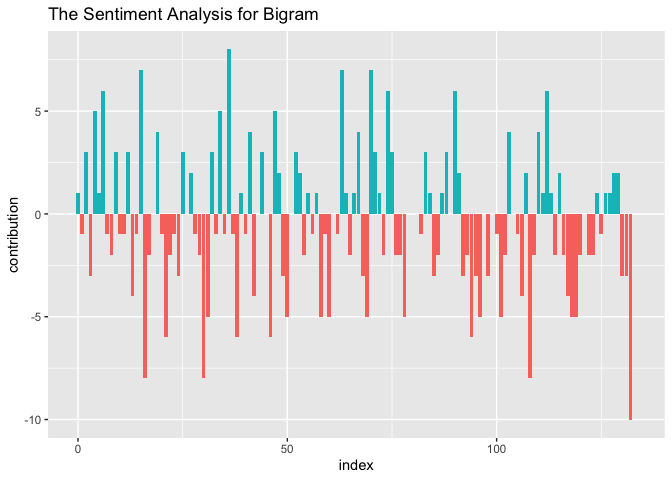
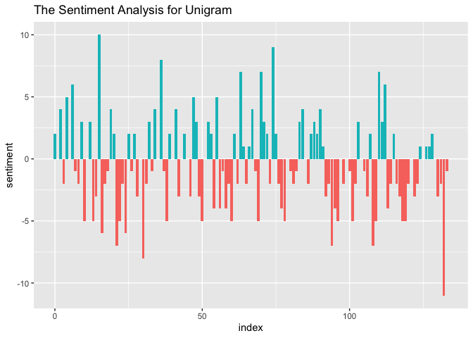
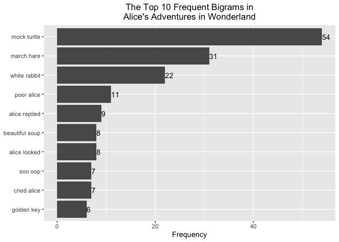
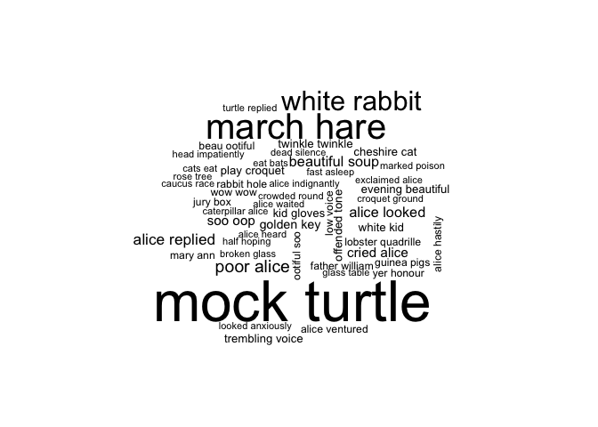
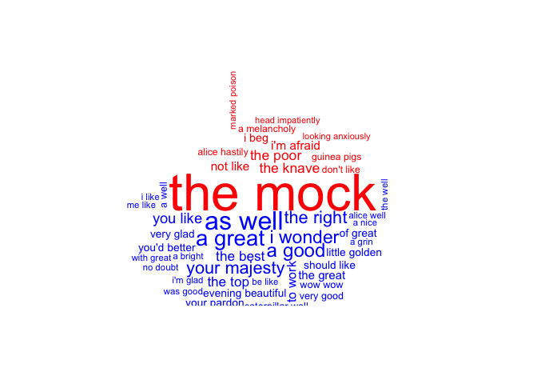

Text Mining in R
================
Kaming Yip

<font size = "4"> In this file, we will introduce tidy text mining and
mainly focus on sentiment analysis with ***Unigram*** and ***Bigram***
in text mining.

## 1\. Tidy Text Format

**Token:** meaningful unit of text, most often a word (***Unigram***)
but can also be several words (***n-gram***), sentence, or paragraph,
that we are interested in using for analysis.

**Tokenization:** the process of splitting text into tokens.

**Tidy Text Format:** a table with one-token-per-row. This
one-token-per-row structure is in contrast to the ways text is often
stored in current analyses, perhaps as strings or in a document-term
matrix.

Other data structures:  
a) *String*: character vectors  
b) *Corpus*: contain raw strings annotated with additional metadata and
details  
c) *Document-Term Matrix*: a collection (i.e. a *corpus*) of documents
with one row for each document and one column for each term.  

### 1.1 Tokenization

We first create a typical charater vector (*string*) as our raw text.

``` r
raw_text <- c("This is a video for AD699 Data Mining.",
              "We will mainly focus on tidy text mining -",
              "in this video.",
              "Hope you will like it :)")
raw_text
```

    ## [1] "This is a video for AD699 Data Mining."    
    ## [2] "We will mainly focus on tidy text mining -"
    ## [3] "in this video."                            
    ## [4] "Hope you will like it :)"

In order to turn it into a tidy text database, we first need to put it
into a data frame. Notice that the data frame has printed out as a
*tibble*, which is a modern class of data frame within R that has a
convenient print method, will not convert strings to factors, and does
not use row names.

``` r
# install.packages("dplyr")
library(dplyr)
```

    ## 
    ## Attaching package: 'dplyr'

    ## The following objects are masked from 'package:stats':
    ## 
    ##     filter, lag

    ## The following objects are masked from 'package:base':
    ## 
    ##     intersect, setdiff, setequal, union

``` r
text_df <- tibble(line = 1:length(raw_text), text = raw_text)
text_df
```

    ## # A tibble: 4 x 2
    ##    line text                                      
    ##   <int> <chr>                                     
    ## 1     1 This is a video for AD699 Data Mining.    
    ## 2     2 We will mainly focus on tidy text mining -
    ## 3     3 in this video.                            
    ## 4     4 Hope you will like it :)

Next step, we need to conduct a process called ***tokenization***, which
breaks the text into individual tokens and transform it to a tidy data
structure.

``` r
# install.packages("tidytext")
library(tidytext)
text_df %>% unnest_tokens(output = tokens, input = text)
```

    ## # A tibble: 24 x 2
    ##     line tokens
    ##    <int> <chr> 
    ##  1     1 this  
    ##  2     1 is    
    ##  3     1 a     
    ##  4     1 video 
    ##  5     1 for   
    ##  6     1 ad699 
    ##  7     1 data  
    ##  8     1 mining
    ##  9     2 we    
    ## 10     2 will  
    ## # … with 14 more rows

The two basic arguments to `unnest_tokens` used here are column names.
First we have the output column name that will be created as the text is
unnested into it (`tokens`, in this case), and then the input column
that the text comes from (`text`, in this case).

Notice that:  
\- Punctuation has been stripped (`.`, `-`, `:`, `)`, in this case).  
\- By default, `unnest_tokens` converts the tokens to lowercase, which
makes them easier to compare or combine with other datasets. (Use the
`to_lower = FALSE` argument to turn off this behavior).  

### 1.2 Tidying Examples

In this section, we will use
[gutenbergr](https://github.com/ropensci/gutenbergr) package as the
source of our raw tidy text. This package contains metadata for all
Project Gutenberg works as R datasets, so that you can search and filter
for particular works before downloading. The dataset
`gutenberg_metadata` contains information about each work, pairing
Gutenberg ID with title, author, language, etc:

``` r
# install.packages("gutenbergr")
library(gutenbergr)
gutenberg_metadata
```

    ## # A tibble: 51,997 x 8
    ##    gutenberg_id title author gutenberg_autho… language gutenberg_books…
    ##           <int> <chr> <chr>             <int> <chr>    <chr>           
    ##  1            0 <NA>  <NA>                 NA en       <NA>            
    ##  2            1 The … Jeffe…             1638 en       United States L…
    ##  3            2 "The… Unite…                1 en       American Revolu…
    ##  4            3 John… Kenne…             1666 en       <NA>            
    ##  5            4 "Lin… Linco…                3 en       US Civil War    
    ##  6            5 The … Unite…                1 en       American Revolu…
    ##  7            6 Give… Henry…                4 en       American Revolu…
    ##  8            7 The … <NA>                 NA en       <NA>            
    ##  9            8 Abra… Linco…                3 en       US Civil War    
    ## 10            9 Abra… Linco…                3 en       US Civil War    
    ## # … with 51,987 more rows, and 2 more variables: rights <chr>,
    ## #   has_text <lgl>

We can select a public domain work from the Project Gutenberg collection
and download it. Here we have NO.11 work as the well-known fairy tale
*Alice’s Adventures in Wonderland* by Lewis
    Carroll.

``` r
raw_text <- gutenberg_download(11)
```

    ## Determining mirror for Project Gutenberg from http://www.gutenberg.org/robot/harvest

    ## Using mirror http://aleph.gutenberg.org

``` r
raw_text
```

    ## # A tibble: 3,339 x 2
    ##    gutenberg_id text                              
    ##           <int> <chr>                             
    ##  1           11 ALICE'S ADVENTURES IN WONDERLAND  
    ##  2           11 ""                                
    ##  3           11 Lewis Carroll                     
    ##  4           11 ""                                
    ##  5           11 THE MILLENNIUM FULCRUM EDITION 3.0
    ##  6           11 ""                                
    ##  7           11 ""                                
    ##  8           11 ""                                
    ##  9           11 ""                                
    ## 10           11 CHAPTER I. Down the Rabbit-Hole   
    ## # … with 3,329 more rows

``` r
tidy_text <- raw_text %>% 
  unnest_tokens(output = tokens, input = text) %>% 
  count(tokens, sort = TRUE)
tidy_text
```

    ## # A tibble: 2,634 x 2
    ##    tokens     n
    ##    <chr>  <int>
    ##  1 the     1644
    ##  2 and      872
    ##  3 to       729
    ##  4 a        632
    ##  5 she      541
    ##  6 it       530
    ##  7 of       514
    ##  8 said     462
    ##  9 i        408
    ## 10 alice    386
    ## # … with 2,624 more rows

Notice that we have tokenized the text format and unnest it to
one-token-per-row structure. However, the most frequent tokens are words
that are not useful for an analysis, tipically extremely common words
such as “the”, “and”, “to”, “a”, and so forth in English. We call them
***stop words***. Often in text analysis, we will want to clean up the
stop words. In this case, we will use the `stop_words` dataset in the
tidytext package, which contains stop words from three lexicons.

``` r
tidy_text <- raw_text %>% 
  unnest_tokens(output = tokens, input = text) %>% 
  anti_join(stop_words, by = c("tokens" = "word")) %>% 
  count(tokens, sort = TRUE)
tidy_text
```

    ## # A tibble: 2,165 x 2
    ##    tokens      n
    ##    <chr>   <int>
    ##  1 alice     386
    ##  2 time       71
    ##  3 queen      68
    ##  4 king       61
    ##  5 turtle     57
    ##  6 mock       56
    ##  7 gryphon    55
    ##  8 hatter     55
    ##  9 head       49
    ## 10 voice      48
    ## # … with 2,155 more rows

``` r
# install.packages("ggplot2")
library(ggplot2)
word_freq <- tidy_text %>% 
  head(10)
ggplot(word_freq, aes(x = reorder(tokens, n), y = n)) +
  geom_bar(stat = "identity") +
  geom_text(aes(label = n), hjust = 0) +
  ggtitle("The Top 10 Frequent Words in\nAlice's Adventures in Wonderland") +
  theme(plot.title = element_text(hjust = 0.5)) +
  xlab(NULL) +
  ylab("Frequency") +
  coord_flip()
```

<!-- -->

## 2\. Sentiment Analysis with Tidy Data

When human readers approach a text, we use our understanding of the
emotional intent of words to infer whether a section of text is
*positive* or *negative*, or perhaps characterized by some other more
nuanced emotion like *surprise* or *anger*. In text mining, sentiment
analysis is esentially important, to understand the information the text
really wants to transmit.

One way to analyze the sentiment of a text is to consider the text as a
combination of its individual words and the sentiment content of the
whole text as the sum of the sentiment content of the individual words.
This isn’t the only way to approach sentiment analysis, but it is an
often-used approach.

### 2.1 The `sentiments` Dataset

Three general-purpose lexicons for evaluating the opinion or emotion in
text are  
\* `AFINN`  
\* `bing`  
\* `nrc`  

#### a. `AFINN`

The `AFINN` lexicon assigns words with a score that runs between -5 and
5, with negative scores indicating negative sentiment and positive
scores indicating positive sentiment.

``` r
get_sentiments(lexicon = "afinn")
```

    ## # A tibble: 2,477 x 2
    ##    word       value
    ##    <chr>      <dbl>
    ##  1 abandon       -2
    ##  2 abandoned     -2
    ##  3 abandons      -2
    ##  4 abducted      -2
    ##  5 abduction     -2
    ##  6 abductions    -2
    ##  7 abhor         -3
    ##  8 abhorred      -3
    ##  9 abhorrent     -3
    ## 10 abhors        -3
    ## # … with 2,467 more rows

#### b. `bing`

The `bing` lexicon categorizes words in a binary fashion into positive
and negative categories.

``` r
get_sentiments(lexicon = "bing")
```

    ## # A tibble: 6,786 x 2
    ##    word        sentiment
    ##    <chr>       <chr>    
    ##  1 2-faces     negative 
    ##  2 abnormal    negative 
    ##  3 abolish     negative 
    ##  4 abominable  negative 
    ##  5 abominably  negative 
    ##  6 abominate   negative 
    ##  7 abomination negative 
    ##  8 abort       negative 
    ##  9 aborted     negative 
    ## 10 aborts      negative 
    ## # … with 6,776 more rows

#### c. `nrc`

The `nrc` lexicon categorizes words in a binary fashion (“yes”/“no”)
into categories of positive, negative, anger, anticipation, disgust,
fear, joy, sadness, surprise, and trust.

``` r
get_sentiments(lexicon = "nrc")
```

    ## # A tibble: 13,901 x 2
    ##    word        sentiment
    ##    <chr>       <chr>    
    ##  1 abacus      trust    
    ##  2 abandon     fear     
    ##  3 abandon     negative 
    ##  4 abandon     sadness  
    ##  5 abandoned   anger    
    ##  6 abandoned   fear     
    ##  7 abandoned   negative 
    ##  8 abandoned   sadness  
    ##  9 abandonment anger    
    ## 10 abandonment fear     
    ## # … with 13,891 more rows

Not every English word is in the lexicons because many English words are
pretty neutral. It is important to keep in mind that these methods do
not take into account qualifiers before a word, such as in “no good” or
“not true”; a lexicon-based method like this is based on
***Unigrams*** only. We will discuss how to conduct sentiment analysis
on ***Bigrams*** later.

### 2.2 Sentiment Analysis with Inner Join

Much as removing stop words is an anti-join operation, performing
sentiment analysis is an inner join operation. Let’s look at the words
with a joy score from the NRC lexicon and find out what the most common
joy words are in *Alice’s Adventures in Wonderland*.

``` r
raw_text <- gutenberg_download(11)
raw_text
```

    ## # A tibble: 3,339 x 2
    ##    gutenberg_id text                              
    ##           <int> <chr>                             
    ##  1           11 ALICE'S ADVENTURES IN WONDERLAND  
    ##  2           11 ""                                
    ##  3           11 Lewis Carroll                     
    ##  4           11 ""                                
    ##  5           11 THE MILLENNIUM FULCRUM EDITION 3.0
    ##  6           11 ""                                
    ##  7           11 ""                                
    ##  8           11 ""                                
    ##  9           11 ""                                
    ## 10           11 CHAPTER I. Down the Rabbit-Hole   
    ## # … with 3,329 more rows

``` r
tidy_text <- raw_text %>% 
  unnest_tokens(output = tokens, input = text)
tidy_text
```

    ## # A tibble: 26,694 x 2
    ##    gutenberg_id tokens    
    ##           <int> <chr>     
    ##  1           11 alice's   
    ##  2           11 adventures
    ##  3           11 in        
    ##  4           11 wonderland
    ##  5           11 lewis     
    ##  6           11 carroll   
    ##  7           11 the       
    ##  8           11 millennium
    ##  9           11 fulcrum   
    ## 10           11 edition   
    ## # … with 26,684 more rows

``` r
nrc_joy <- get_sentiments("nrc") %>% 
  filter(sentiment == "joy")
tidy_text %>% 
  inner_join(nrc_joy, by = c("tokens" = "word")) %>% 
  count(tokens, sort = TRUE)
```

    ## # A tibble: 95 x 2
    ##    tokens        n
    ##    <chr>     <int>
    ##  1 found        32
    ##  2 white        30
    ##  3 good         27
    ##  4 garden       16
    ##  5 baby         14
    ##  6 beautiful    13
    ##  7 dance        13
    ##  8 grow         13
    ##  9 deal         12
    ## 10 child        11
    ## # … with 85 more rows

We see mostly positive, happy words about garden, baby, and dance here.
We also see some words that may not be used joyfully in this book
(“found”, “white”). One way to deal with these undesired, or
misclassified, words is to create a custom lexicon based on the existing
ones. In this case, we use `nrc` lexicon.

``` r
custom_nrc <- get_sentiments("nrc")
custom_nrc[custom_nrc$word == "found", ]
```

    ## # A tibble: 3 x 2
    ##   word  sentiment
    ##   <chr> <chr>    
    ## 1 found joy      
    ## 2 found positive 
    ## 3 found trust

``` r
custom_nrc$sentiment[custom_nrc$word == "found"] <- "neutral"
custom_nrc[custom_nrc$word == "found", ]
```

    ## # A tibble: 3 x 2
    ##   word  sentiment
    ##   <chr> <chr>    
    ## 1 found neutral  
    ## 2 found neutral  
    ## 3 found neutral

Now we want to examine how sentiment is throughout the entire book. This
time, we will try `bing` lexicon instead of `nrc`.

``` r
library(tidyr)
alice_sentiment <- raw_text %>% 
  mutate(linenumber = row_number()) %>% 
  unnest_tokens(tokens, text) %>% 
  inner_join(get_sentiments("bing"), by = c("tokens" = "word")) %>% 
  count(index = linenumber %/% 25, sentiment) %>% 
  spread(sentiment, n, fill = 0) %>% 
  mutate(sentiment = positive - negative,
         fill = ifelse(sentiment >= 0, "positive score", "negative score"))
alice_sentiment
```

    ## # A tibble: 134 x 5
    ##    index negative positive sentiment fill          
    ##    <dbl>    <dbl>    <dbl>     <dbl> <chr>         
    ##  1     0        3        5         2 positive score
    ##  2     1        6        6         0 positive score
    ##  3     2       11       15         4 positive score
    ##  4     3        7        5        -2 negative score
    ##  5     4        2        7         5 positive score
    ##  6     5        9        9         0 positive score
    ##  7     6        4       10         6 positive score
    ##  8     7       10        9        -1 negative score
    ##  9     8        4        2        -2 negative score
    ## 10     9        6        9         3 positive score
    ## # … with 124 more rows

``` r
ggplot(alice_sentiment, aes(x = index, y = sentiment, fill = factor(fill))) +
  geom_col(show.legend = FALSE)
```

<!-- -->

We can see in the figure how the plot of the book changes toward a
slightly negative sentiment over the trajectory of the story. This is a
interesting finding in this case.

### 2.3 Wordclouds

Wordclouds can be applied in text mining to visualize the word
frequency.

``` r
library(wordcloud)
```

    ## Loading required package: RColorBrewer

``` r
raw_text <- gutenberg_download(11)
tidy_text <- raw_text %>% 
  unnest_tokens(output = tokens, input = text) %>% 
  anti_join(stop_words, by = c("tokens" = "word")) %>% 
  count(tokens, sort = TRUE)
ggplot(head(tidy_text, 10), aes(x = reorder(tokens, n), y = n)) +
  geom_bar(stat = "identity") +
  geom_text(aes(label = n), hjust = 0) +
  ggtitle("The Top 10 Frequent Words in\nAlice's Adventures in Wonderland") +
  theme(plot.title = element_text(hjust = 0.5)) +
  xlab(NULL) +
  ylab("Frequency") +
  coord_flip()
```

<!-- -->

``` r
tidy_text %>% 
  with(wordcloud(tokens, n, max.words = 100))
```

<!-- -->

As we can see from both the bar plot and the wordcloud, the word *alice*
is the most frequent word, and *time*, *queen*, *king*, *turtle*, and
*mock* those are also frequent words in the text. And we can generally
get what this fairy tale talks about through the results.

Another application of wordcloud is called `comparison.cloud()`. Let’s
do the sentiment analysis to tag positive and negative words using an
inner join, then find the most common positive and negative words.

``` r
library(reshape2)
```

    ## 
    ## Attaching package: 'reshape2'

    ## The following object is masked from 'package:tidyr':
    ## 
    ##     smiths

``` r
raw_text <- gutenberg_download(11)
tidy_text <- raw_text %>% 
  unnest_tokens(output = tokens, input = text) %>% 
  inner_join(get_sentiments("bing"), by = c("tokens" = "word")) %>% 
  count(tokens, sentiment, sort = TRUE) %>% 
  acast(tokens ~ sentiment, value.var = "n", fill = 0) %>% 
  comparison.cloud(colors = c("red", "blue"), max.words = 100)
```

<!-- -->

## 3\. Relationships between Words: Unigram and Bigram

So far we’ve considered words as individual units, and considered their
relationships to sentiments pr to documents. However, many interesting
text analyses are based on the relationships between words. In this
part, we will explore some of the methods tidytext offers for
calculating and visualizing relationships between words in text dataset.

### 3.1 Tokenizing by Bigram

We’ve been using the `unnest_tokens` function to tokenize by words,
which is useful for the kinds of sentiment and frequency analyses we’ve
been doing so far. But we can also use the function to tokenize into
consecutive sequences of words, called **n-grams**. In this video, we
will set n to 2, often called **Bigram**.

``` r
library(dplyr)
library(tidytext)
library(gutenbergr)
raw_text <- gutenberg_download(11)
tidy_text <- raw_text %>% 
  unnest_tokens(output = bigram, input = text, token = "ngrams", n = 2)
tidy_text
```

    ## # A tibble: 26,693 x 2
    ##    gutenberg_id bigram            
    ##           <int> <chr>             
    ##  1           11 alice's adventures
    ##  2           11 adventures in     
    ##  3           11 in wonderland     
    ##  4           11 wonderland lewis  
    ##  5           11 lewis carroll     
    ##  6           11 carroll the       
    ##  7           11 the millennium    
    ##  8           11 millennium fulcrum
    ##  9           11 fulcrum edition   
    ## 10           11 edition 3.0       
    ## # … with 26,683 more rows

This data structure is still a variation of the tidy text format. It is
structured as one-token-per-row, but each token now represents a bigram.
Notice that these bigrams overlap: *“alice’s adventures”* is one token,
while *“adventures in”* is another.

``` r
tidy_text %>% 
  count(bigram, sort = TRUE)
```

    ## # A tibble: 14,740 x 2
    ##    bigram         n
    ##    <chr>      <int>
    ##  1 said the     210
    ##  2 of the       133
    ##  3 said alice   116
    ##  4 in a          97
    ##  5 and the       82
    ##  6 in the        80
    ##  7 it was        76
    ##  8 to the        69
    ##  9 the queen     65
    ## 10 as she        61
    ## # … with 14,730 more rows

As you might expect, a lot of the most common bigrams are pairs of
common (uninteresting) words, such as `said the` and `of the`: what we
call “stop-words”. This time, in order to remove those cases, we use
`separate()` function from `tidyr` package to split a column into two
columns, “word 1” and “word 2” and we can remove cases where either is a
stop-word.

``` r
library(tidyr)
bigrams_separated <- tidy_text %>% 
  separate(bigram, c("word1", "word2"), sep = " ")
bigrams_separated
```

    ## # A tibble: 26,693 x 3
    ##    gutenberg_id word1      word2     
    ##           <int> <chr>      <chr>     
    ##  1           11 alice's    adventures
    ##  2           11 adventures in        
    ##  3           11 in         wonderland
    ##  4           11 wonderland lewis     
    ##  5           11 lewis      carroll   
    ##  6           11 carroll    the       
    ##  7           11 the        millennium
    ##  8           11 millennium fulcrum   
    ##  9           11 fulcrum    edition   
    ## 10           11 edition    3.0       
    ## # … with 26,683 more rows

``` r
bigrams_filtered <- bigrams_separated %>% 
  filter(!word1 %in% stop_words$word) %>% 
  filter(!word2 %in% stop_words$word) %>% 
  count(word1, word2, sort = TRUE)
bigrams_filtered
```

    ## # A tibble: 1,288 x 3
    ##    word1     word2       n
    ##    <chr>     <chr>   <int>
    ##  1 mock      turtle     54
    ##  2 march     hare       31
    ##  3 white     rabbit     22
    ##  4 poor      alice      11
    ##  5 alice     replied     9
    ##  6 alice     looked      8
    ##  7 beautiful soup        8
    ##  8 cried     alice       7
    ##  9 soo       oop         7
    ## 10 golden    key         6
    ## # … with 1,278 more rows

``` r
bigrams_united <- bigrams_filtered %>% 
  unite(bigram, word1, word2, sep = " ")
bigrams_united
```

    ## # A tibble: 1,288 x 2
    ##    bigram             n
    ##    <chr>          <int>
    ##  1 mock turtle       54
    ##  2 march hare        31
    ##  3 white rabbit      22
    ##  4 poor alice        11
    ##  5 alice replied      9
    ##  6 alice looked       8
    ##  7 beautiful soup     8
    ##  8 cried alice        7
    ##  9 soo oop            7
    ## 10 golden key         6
    ## # … with 1,278 more rows

### 3.2 Using Bigrams to Provide Context in Sentiment Analysis

Our sentiment analysis approach in previous part simply counted the
apprearance of positive or negative words, according to a reference
lexicon. One of the problems with this approach is that a word’s context
can matter nearly as much as its presence. For example, the words
“happy” and “like” will be counted as positive, even in a sentence
like “I’m not **happy** and I don’t **like** it\!”

Now that we have the data organized into bigrams, it’s easy to tell how
often words are preceded by a word like “not”:

``` r
bigrams_separated %>% 
  filter(word1 == "not") %>% 
  count(word1, word2, sort = TRUE)
```

    ## # A tibble: 81 x 3
    ##    word1 word2     n
    ##    <chr> <chr> <int>
    ##  1 not   a         9
    ##  2 not   like      7
    ##  3 not   said      6
    ##  4 not   the       6
    ##  5 not   at        5
    ##  6 not   could     5
    ##  7 not   to        5
    ##  8 not   quite     4
    ##  9 not   gone      3
    ## 10 not   join      3
    ## # … with 71 more rows

By performing sentiment analysis on the bigram data, we can examine how
often sentiment-associated words are preceded by “not” or other negative
words. We could use this to ignore or even reverse their contribution to
the sentiment score.

Let’s use the `AFINN` lexicon for sentiment analysis, which you may
recall gives a numeric sentiment value for each word, with positive or
negative numbers indicating the direction of the sentiment.

``` r
AFINN <- get_sentiments(lexicon = "afinn")
AFINN
```

    ## # A tibble: 2,477 x 2
    ##    word       value
    ##    <chr>      <dbl>
    ##  1 abandon       -2
    ##  2 abandoned     -2
    ##  3 abandons      -2
    ##  4 abducted      -2
    ##  5 abduction     -2
    ##  6 abductions    -2
    ##  7 abhor         -3
    ##  8 abhorred      -3
    ##  9 abhorrent     -3
    ## 10 abhors        -3
    ## # … with 2,467 more rows

``` r
reverse_words <- bigrams_separated %>% 
  filter(word1 %in% c("don't", "not", "no", "never")) %>% 
  inner_join(AFINN, by = c(word2 = "word")) %>% 
  count(word2, value, sort = TRUE)
reverse_words
```

    ## # A tibble: 26 x 3
    ##    word2  value     n
    ##    <chr>  <dbl> <int>
    ##  1 like       2    11
    ##  2 doubt     -1     3
    ##  3 join       1     3
    ##  4 no        -1     3
    ##  5 want       1     3
    ##  6 chance     2     2
    ##  7 help       2     2
    ##  8 allow      1     1
    ##  9 bother    -2     1
    ## 10 care       2     1
    ## # … with 16 more rows

For example, the most common sentiment-associated word to follow those
nagtive words was “like”, which would normally have a positive score of
2.

It’s worth asking which words contributed the most in the “wrong”
direction. To compute that, we can multiply their value by the number of
times they appear.

``` r
library(ggplot2)
reverse_words %>% 
  mutate(contribution = n * value) %>% 
  arrange(desc(abs(contribution))) %>% 
  head(10) %>% 
  mutate(word2 = reorder(word2, contribution)) %>% 
  ggplot(aes(x = word2, y = contribution, fill = contribution > 0)) +
  geom_col(show.legend = FALSE) +
  xlab("Word preceded by reverse words") +
  ylab("Sentiment value * number of occurrences") +
  coord_flip()
```

<!-- -->

The bigram “don’t/not/no like” was overwhelmingly the largest causes of
misidentification, making the text seem much more positive than it is.
But we also can see some phrases suggest text is more negative than it
is.

To see the influence of the reverse words toward our context sentiment,
we will try to examine how sentiment is throughout the entire book and
compare the result when we apply unigram to the sentiment analysis.

``` r
library(tidyr)
alice_bigram_sentiment <- raw_text %>% 
  mutate(linenumber = row_number()) %>% 
  unnest_tokens(output = bigram, input = text, token = "ngrams", n = 2) %>% 
  separate(bigram, c("word1", "word2"), sep = " ") %>% 
  inner_join(get_sentiments("bing"), by = c("word2" = "word")) %>% 
  mutate(contribution = ifelse(word1 %in% c("don't", "no", "not", "never"),
                               ifelse(sentiment == "negative", "positive", "negative"), sentiment)) %>% 
  count(index = linenumber %/% 25, contribution) %>% 
  spread(contribution, n, fill = 0) %>% 
  mutate(contribution = positive - negative,
         fill = ifelse(contribution >= 0, "positive score", "negative score"))
alice_bigram_sentiment
```

    ## # A tibble: 134 x 5
    ##    index negative positive contribution fill          
    ##    <dbl>    <dbl>    <dbl>        <dbl> <chr>         
    ##  1     0        3        4            1 positive score
    ##  2     1        6        5           -1 negative score
    ##  3     2       10       13            3 positive score
    ##  4     3        6        3           -3 negative score
    ##  5     4        2        7            5 positive score
    ##  6     5        8        9            1 positive score
    ##  7     6        4       10            6 positive score
    ##  8     7        9        8           -1 negative score
    ##  9     8        4        2           -2 negative score
    ## 10     9        6        9            3 positive score
    ## # … with 124 more rows

``` r
ggplot(alice_bigram_sentiment, aes(x = index, y = contribution, fill = factor(fill))) +
  geom_col(show.legend = FALSE) +
  ggtitle("The Sentiment Analysis for Bigram")
```

<!-- -->

``` r
ggplot(alice_sentiment, aes(x = index, y = sentiment, fill = factor(fill))) +
  geom_col(show.legend = FALSE) +
  ggtitle("The Sentiment Analysis for Unigram")
```

<!-- -->

Although it’s hard to tell what changes exactly occur in this case, we
can tell there is some changes between unigram sentiment analysis and
bigram sentiment analysis. In future research, we can apply both
analysis process to examine how sentiment really is throughout a given
text.

### 3.3 Create a Bigram Wordcloud

``` r
library(wordcloud)
library(ggplot2)
library(reshape2)
raw_text <- gutenberg_download(11)
tidy_text <- raw_text %>% 
  unnest_tokens(output = bigram, input = text, token = "ngrams", n = 2)
tidy_text
```

    ## # A tibble: 26,693 x 2
    ##    gutenberg_id bigram            
    ##           <int> <chr>             
    ##  1           11 alice's adventures
    ##  2           11 adventures in     
    ##  3           11 in wonderland     
    ##  4           11 wonderland lewis  
    ##  5           11 lewis carroll     
    ##  6           11 carroll the       
    ##  7           11 the millennium    
    ##  8           11 millennium fulcrum
    ##  9           11 fulcrum edition   
    ## 10           11 edition 3.0       
    ## # … with 26,683 more rows

``` r
bigrams_united <- tidy_text %>% 
  separate(bigram, c("word1", "word2"), sep = " ") %>% 
  filter(!word1 %in% stop_words$word) %>% 
  filter(!word2 %in% stop_words$word) %>% 
  count(word1, word2, sort = TRUE) %>% 
  unite(bigram, word1, word2, sep = " ")
bigrams_united
```

    ## # A tibble: 1,288 x 2
    ##    bigram             n
    ##    <chr>          <int>
    ##  1 mock turtle       54
    ##  2 march hare        31
    ##  3 white rabbit      22
    ##  4 poor alice        11
    ##  5 alice replied      9
    ##  6 alice looked       8
    ##  7 beautiful soup     8
    ##  8 cried alice        7
    ##  9 soo oop            7
    ## 10 golden key         6
    ## # … with 1,278 more rows

``` r
ggplot(head(bigrams_united, 10), aes(x = reorder(bigram, n), y = n)) +
  geom_bar(stat = "identity") +
  geom_text(aes(label = n), hjust = 0) +
  ggtitle("The Top 10 Frequent Bigrams in\nAlice's Adventures in Wonderland") +
  theme(plot.title = element_text(hjust = 0.5)) +
  xlab(NULL) +
  ylab("Frequency") +
  coord_flip()
```

<!-- -->

``` r
bigrams_united %>% 
  with(wordcloud(bigram, n, max.words = 100))
```

<!-- -->

``` r
bigram_compare_wordcloud <- tidy_text %>% 
  separate(bigram, c("word1", "word2"), sep = " ") %>% 
  inner_join(get_sentiments("bing"), by = c("word2" = "word")) %>% 
  mutate(contribution = ifelse(word1 %in% c("don't", "no", "not", "never"),
                               ifelse(sentiment == "negative", "positive", "negative"), sentiment)) %>% 
  unite(bigram, word1, word2, sep = " ") %>% 
  count(bigram, contribution, sort = TRUE) %>% 
  acast(bigram ~ contribution, value.var = "n", fill = 0) %>% 
  comparison.cloud(colors = c("red", "blue"), max.words = 50)
```

<!-- -->

-----

This content was mainly built from material contained in “Text Mining in
R” and “Data Mining for Business Analytics”. So if you want to dig into
these topics more, we suggest you take a look at those rescources.
